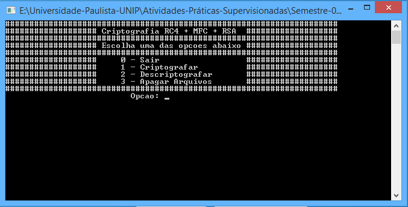

# Criptografia RC4
Este programa foi desenvolvido para a Atividade Prática Supervisionada (APS) do segundo semestre na Universidade Paulista - UNIP.

<p align="center">
</img>
</p>

## Tecnologias Utilizadas
C e algoritmo RC4.

## O que é o RC4?
O RC4 é uma melhoria do RC2, desenvolvido também por Ron Rivest. RC2 é uma cifra de bloco, similar ao DES. RC4 é uma cifra de corrente, onde o algoritmoproduz uma corrente de números pseudoaleatórios que são cifrados através de uma operação lógica XOR com a própria mensagem. Ele é uma técnica de cifra amplamente utilizada no mundo. Embora já exista uma nova versão do algoritmo (RC6) e, atualmente, outras técnicas mais seguras e velozes.

### Conceito e Fundamentação
O RC4 usa o modo de fluxo de cifras que funciona pela codificação de um vetor de referência com uma chave para obter um bloco de saída. O bloco de saída é então codificado, usando-se a chave para obter um segundo bloco de saída. Em seguida, esse bloco é codificado para obter um terceiro bloco e assim por diante. A sequência de bloco de saída é tratada como uma chave única e submetida a uma operação XOR com texto simples para obter texto cifrado.

#### Estrutura
As transformações no algoritmo RC4 são lineares, não são necessários cálculos complexos, já que o sistema funciona basicamente por permutações e somas de valores inteiros. Seu funcionamento é simples, ele tem uma fase de inicialização da chave chama de key-scheduling algorithm (KSA). O RC4 aceita chaves de 1 a 256 bits. Utiliza um vetor S que é primeiramente inicializado em sua totalidade.

```
para i de 0 até 256 passo 1 faça
  s [i] <-- i;
fim-para
```

Após, o vetor S é processado com 256 iterações do algoritmo geração pseudoaleatória e, ao mesmo tempo, combina o resultado do algoritmo geração pseudoaleatória aos valores da chave.

```
procedimento troca(s : conjunto [0...256] de caracteres, i, j : inteiro)
	incio
		s [i] <-- s [i] + s [j];
		s [j] <-- s [i] - s [j];
		s [i] <-- s [i] - s [j];
	fim
```

```
j <-- 0;
para i de 0 até 256 passo 1 faça
  j <-- (j + s [i] + key [i mod tamanhoKey]) mod 256;
  troca(s, i, j);
fim-para
```

O fluxo principal de cifração utiliza o algoritmo FRGA. A cada iteração, o algoritmo geração pseudoaleatória modifica o seu estado interno e gera um byte de saída. O FRGA permanece ativo até que todos os valores do texto plano sejam processados. A saída é o resultado de uma operação XOR entre o byte de entrada e o módulo de 256 do valor do vetor S, na posição S[i] + S[j]. Cada valor da posição S[i] é trocado com a posição S[j], a cada 256 iterações.

```
procedimento prga(plain : conjunto [0...256] de caracteres, i, j, tamanhoPlainText : inteiro)
	var
		aux : inteiro;
		result : conjunto [0...tamanhoPlainText - 1];
	inicio
		para aux de 0 até tamanhoPlainText passo 1 faça
			i <-- (i + 1) mod 256;
			j <-- (j + s [i]) mod 256;
			troca(s, i, j);
			result [aux] <-- (s [(s [i] + s [j]) mod 256]) xor plain [aux];
		fim-para
		
		strcpy(chiper, result);
	fim
```

De uma forma geral, o algoritmo consiste em utilizar um array que a cada utilização tem os seus valores permutados, e misturados com a chave. Esta chave utilizada na inicialização do array pode ter até 256 bytes (2048 bits), embora o algoritmo seja mais eficiente quando é menor, pois a perturbação aleatória induzida no array é superior.

## Implementação
A implementação do método 'troca' ficou da seguinte maneira:

```
void troca(unsigned char *s, unsigned short *i, unsigned short *j)
{
  s[*i] = s[*i] + s[*j];
  s[*j] = s[*i] - s[*j];
  s[*i] = s[*i] - s[*j];
}
```

```
for (*i = 0; *i < 256; (*i)++)
{
  *j = (*j + s[*i] + key[*i % *tamanhoKey]) % 256;
  troca(s, i, j);
}
```

A implementação do método 'prga' ficou da seguinte maneira:

```
void prga(unsigned char *plain, unsigned short *i, unsigned short *j, unsigned short *tamanhoPlainText)
{
  unsigned int aux;
  unsigned char result[*tamanhoPlainText-1];

  for (aux = 0; aux < *tamanhoPlainText; aux++)
  {
    *i = (*i + 1) % 256;
    *j = (*j + s[*i]) % 256;
    troca(s, i, j);
    result[aux] = (s[(s[*i] + s[*j]) % 256]) ^ *(plain + aux);
  }

  chiper = (unsigned char*) calloc((*tamanhoPlainText - 1), (sizeof(unsigned char)));
  strcpy(chiper, result);
}
```
